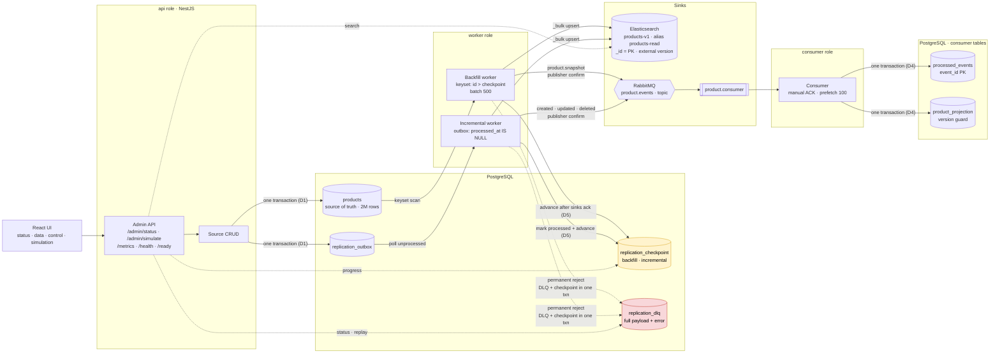

# Kill It Twice

A replication pipeline that moves 2,000,000 products from PostgreSQL into Elasticsearch and
RabbitMQ, keeps a projection built from the event stream, and stays correct when any part of
it is killed, stopped, or fed bad data.

The deliverable is **one command**:

```bash
make verify
```

It starts from an empty volume, seeds 2,000,000 rows, then kills the worker three times
mid-backfill, holds Elasticsearch down for a minute, poisons a batch, and prints a PASS or
FAIL line per gate. It takes about six minutes.

---

## Running it

**Prerequisites:** Docker with Compose. Nothing else — no host Node, no global installs.

```bash
make up          # postgres, elasticsearch, rabbitmq, api, worker, consumer
make seed        # migrate, then 2,000,000 products via COPY FROM STDIN (~5s)
make verify      # the five gates, from a cold start
```

The UI is at **http://localhost:3000**, served by the `api` container.

**Use `make up`, not `docker compose up` directly.** `.env` is deliberately not committed, and
compose needs it for interpolation — without it every `${VAR}` resolves to empty and it fails
with `no port specified`. The Makefile creates `.env` from `.env.example` on first use, and
`verify.sh` does the same, so both work on a fresh clone with nothing else installed.

| Command | What it does |
| --- | --- |
| `make up` | build and start everything, waiting for healthchecks |
| `make seed` | run migrations, then seed (truncates and reseeds; safe to repeat) |
| `make verify` | wipe volumes, seed, run G1–G5 |
| `make clean` | `docker compose down -v` — the true cold start |
| `make logs` | tail every service |
| `make psql` | a psql shell on the source database |

`./verify.sh --keep g3 g4` reuses a running stack and runs only those gates, which turns a
six-minute loop into seconds while debugging. G1 and G2 need a fresh backfill, and G5 reads
measurements G3 takes, so those combinations need the full run.

---

## What it looks like



Both pipelines run **concurrently** and both write to **both sinks**. The backfill walks
`products` by keyset (`WHERE id > $1 ORDER BY id LIMIT 500`) and publishes `product.snapshot`;
the incremental worker drains `replication_outbox` and publishes `product.created`,
`.updated`, `.deleted`.

**Where the checkpoints are:** `replication_checkpoint`, one row per pipeline. The backfill's
is a product id, the incremental's is an outbox row id. Nothing advances a checkpoint before
the work it covers is durable.

**Where the DLQ is:** `replication_dlq`, holding the complete payload as sent, the real error
text from the sink, the attempt count, and `checkpoint_at` — where the pipeline stood when the
item failed.

One image, three roles selected by `APP_ROLE`:

| Role | Runs |
| --- | --- |
| `api` | admin API, `/metrics`, and the UI |
| `worker` | backfill worker and incremental worker, concurrently |
| `consumer` | RabbitMQ consumer and projection writer |

---

## The delivery guarantee

Stated precisely, because a vaguer claim would be a stronger-sounding lie:

- The pipeline delivers each change to each sink **at least once**.
- Both sinks are **idempotent**, so re-delivery converges to the same final state.
- Therefore the observable end state is **effectively-once**.

This is **not** exactly-once, and nothing here claims it is. Exactly-once across a database,
a search index and a broker needs distributed coordination that could not be built or proven
in nine days.

The two mechanisms that make the claim true:

**Elasticsearch** — `_id` is the Postgres primary key and every write uses
`version_type: external` with the row's `version`. Re-indexing overwrites; it never
duplicates. A `version_conflict_engine_exception` means a newer version already landed, so it
is counted as **applied**, not failed.

**The consumer** — `processed_events(event_id PRIMARY KEY)` and the projection write share one
transaction. A redelivery hits the primary key, is swallowed, and is acked. Event ids are
derived from the outbox row id (`outbox-843210`), never random, so they are stable across
retries.

---

## Gates

Measured on the run recorded in `verify-output.txt`, from a cold start on a 2021 MacBook Pro
(8 GB available to Docker).

| Gate | Result | Evidence |
| --- | --- | --- |
| G1 crash recovery | **PASS** | killed at 416,500, resumed at 418,500, 0 lost |
| G2 no duplicates | **PASS** | 2,000,000 source / 2,000,000 es / 2,000,000 projection, 0 duplicate ids, 3 kill cycles |
| G3 sink outage | **PASS** | 60s down, 0 lost, recovered in 9s, 12 Elasticsearch attempts, 0.4% CPU |
| G4 partial batch | **PASS** | 497 indexed / 3 dead-lettered, checkpoint 307 → 920, corrected replay indexed |
| G5 observability | **PASS** | 5/5 questions answered, lag 59.7s → 0s across the outage, `/ready` 200 |

Total: **371 seconds**, against the fifteen-minute budget in SPEC §2.

Reproduced from a clean clone — `git clone`, `make up`, `make seed`, `make verify` on a machine
that had never built this project — passing in 393s, then again in 371s with no cleanup between
the two runs.

The G5 line is the one worth reading twice. A 60-second outage produced 59.7 seconds of lag
and then zero — a number that can only track the outage that closely if it is computed from
the oldest unprocessed outbox row on every scrape. Each of the other four answers is
cross-checked against Postgres in the same gate, because a stale or hardcoded metric would
still resolve to *a* value; it just would not agree.

No gate is failing, so there is nothing to explain away. Three things about *how* they are
run are worth stating plainly, because each is a judgement I made rather than something the
spec dictated:

**G1 and G2 share one backfill.** Running them as separate backfills costs about sixteen
minutes, over the fifteen-minute budget in SPEC §2. One run with three kill cycles satisfies
both: G1 asserts on the first resume, G2 on the final convergence. Neither assertion is
weakened, but they are not independent runs.

**G4 stops the worker before injecting.** Poison records and outbox rows are both waiting when
it restarts, so the first batch is exactly 500 — 497 real records and 3 poison. Injecting into
a running worker makes the batch composition a race, and "3 rejections in a 500-record batch"
would become approximately true rather than true.

**G5 depends on G3.** The only honest way to show the lag metric is live is to watch it climb
while the pipeline is stalled and fall when it recovers, so G3 samples it and G5 asserts on
what G3 saw.

---

## Capacity

Everything below is measured, not estimated. Where an earlier estimate was wrong, the spec was
corrected rather than the measurement.

| Stage | Throughput | Notes |
| --- | --- | --- |
| Seed | ~428,000 rows/s | `COPY FROM STDIN`, 2,000,000 rows in 4.7s |
| Backfill → Elasticsearch only | ~70,800 rows/s | measured before D6 put RabbitMQ in the path |
| Backfill → both sinks | ~14,000 rows/s | 2,000,000 in 144s |
| Consumer → projection | ~8,000 events/s | the bottleneck |
| Full `make verify` | 326–389s | all five gates, cold, across five runs |

Data size: **526 MB** for 2,000,000 rows — 423 MB heap plus 103 MB indexes, about 276 bytes
per row.

### The bottleneck is the consumer, and it was predicted

D6 said that making the backfill publish to RabbitMQ would make the consumer the pacing item.
It does. The worker publishes at roughly 14,000/s; the consumer acknowledges at roughly
8,000/s. The difference accumulates in `product.consumer`, which peaks near **925,000
messages** before draining.

### How I would double it

In the order I would actually try them:

1. **Batch the projection writes.** Every message is currently one transaction — one dedup
   insert plus one upsert. Committing in batches of 100 would cut transaction overhead by far
   more than it costs in redelivery granularity. This is the cheapest large win.
2. **Raise prefetch past 100.** Only useful once the projection write stops being the limit,
   and it costs memory in the broker.
3. **Run several consumers on the same queue.** The projection is keyed by product id and the
   per-aggregate ordering below is already per-id, so N consumers are safe as long as each
   product's events land on one of them — which needs a consistent-hash exchange, not the
   topic exchange used here.

### The capacity limit that is still there

Removing the demonstration queue (see below) roughly tripled the broker's headroom but did not
remove the peak. On a machine with meaningfully less than 8 GB, 925,000 queued messages could
still trip RabbitMQ's memory watermark and block publishers. The fix is item 1 above — a
faster consumer never lets the backlog build — and it is not implemented.

---

## Decisions

Full reasoning, including what was rejected, is in `SPEC.md` §3. These are the four that
shaped everything else.

### ADR 1 — Transactional outbox, not CDC

**Decision.** Every write to `products` inserts a row into `replication_outbox` in the same
transaction. The incremental worker reads the outbox.

**Rejected: Debezium or Postgres logical replication.** It is the better answer for a source
I do not own, and what I would reach for in production against a third-party database.
Standing up a connector, a replication slot, and the schema-change handling around it would
have taken two to three of nine days and tested nothing the gates test.

**Rejected: `updated_at` polling.** Loses deletes, needs an overlap window to survive clock
skew, and records that something changed without recording what.

**The trade this exposes.** An outbox requires owning the writer. The brief describes data
arriving from client systems, which I would not own. I am modelling the source as a system I
control. If it were genuinely third-party this decision flips to logical replication — and
nothing else in the design changes, because the outbox is the only component that would be
replaced.

### ADR 2 — Deterministic `_id` with external versioning

**Decision.** Elasticsearch `_id` is the Postgres primary key; every write uses
`version_type: external` with `products.version`. A version conflict is success.

**Rejected: letting Elasticsearch generate ids.** Re-indexing after a crash would duplicate
every record in the replayed range, and G2 would be unpassable.

**Rejected: deduplicating in the worker.** It would need to remember what it had sent, which
is state that has to survive a `docker kill` — so it would become another checkpoint, with
another chance to disagree with the first one.

**What it buys.** This is the single decision that makes the concurrent design in ADR 3 safe.
A backfill batch carrying version 4 physically cannot overwrite an incremental write of
version 7. Without it, the two pipelines would need to be sequenced.

**The trap.** A version conflict looks like an error in every client library, and counting it
as one is the most likely bug in a system of this shape. `verify.sh` asserts against it.

### ADR 3 — Both pipelines run concurrently, and both write to both sinks

**Decision.** Backfill and incremental start together. No handoff, no watermark. The backfill
publishes `product.snapshot` to RabbitMQ as well as indexing to Elasticsearch.

**Rejected: backfill, then replay from a boundary.** Simpler to reason about, but the brief
requires both modes running simultaneously, and it makes the long backfill a window in which
live changes are durable but not applied.

**Rejected (in v1, and reversed): backfill writes to Elasticsearch only.** That left the
projection holding only the few thousand live changes, so G2's three counts did not match and
the gate needed a paragraph of prose to read as a pass. A gate that needs explaining is a weak
gate. Revising this cost a consumer version guard and made the consumer the bottleneck; both
were worth it.

**The consequence I did not anticipate** is in ADR 4.

### ADR 4 — Events are ordered per aggregate, not globally

**Decision.** The consumer chains handlers per `aggregateId`. Events for one product run in
sequence; different products stay fully concurrent.

**Why it exists.** The first full run produced 2,000,002 rows in the projection against
2,000,001 in the source. A product created and soft-deleted moments apart survived its own
deletion. A queue delivers in order, but `prefetch: 100` means a hundred handlers are in
flight at once — nothing was serialising them, and `product.deleted` won the race against its
own `product.created`. The DELETE matched zero rows; the INSERT then created the row.

**Why the version guard could not catch it.** `WHERE excluded.version > product_projection.version`
needs an existing row to compare against. After a delete there is none. The guard protects
against a stale update overwriting a fresh one, which is what it was designed for. It says
nothing about a delete arriving before the thing it deletes.

**Rejected: serialising everything.** It would also have fixed it, and would have made the
already-bottlenecked consumer dramatically slower for no correctness gain.

**Cost.** A `Map` of in-flight chains, one entry per product currently being written, removed
as each settles.

---

## What I did not build, and why

| Left out | Why |
| --- | --- |
| Exactly-once | Needs distributed coordination I could neither build nor prove in nine days. The effectively-once claim above is what the design actually supports. |
| Horizontal scaling of the worker | A single worker is honest and provable. Concurrency needs advisory locks or partitioned cursors; it is the first thing I would add. |
| Multiple parallel consumers | Named above as the throughput fix, measured, not built. Needs a consistent-hash exchange to preserve per-aggregate ordering. |
| Batch-committed projection writes | The cheapest doubling of throughput, and the fix for the memory ceiling. Ran out of clock. |
| A second bound-but-undrained queue | Built, then removed — it caused a real outage. See the deviations below. |
| Schema evolution / zero-downtime reindex | The `products-read` alias exists to make it possible; the procedure is not implemented. |
| Auth, multi-tenancy | Zero signal for the gates. |
| Angular | Optio's frontend stack and the better signal, but I am faster in React by enough to matter against a nine-day clock. A conscious trade, not an oversight. |
| TanStack Query from the start | Adopted late, after the UI already worked. The hand-rolled polling hook it replaced had a real race in the search screen. |
| A regression test for the ordering bug's *integration* path | The serialiser has unit tests; the end-to-end behaviour is proven only by `make verify`. |

---

## Where the AI deviated from the spec

`DEVLOG.md` has five entries written as they happened, including the unflattering ones. The
two that matter most:

### The Elasticsearch index was never created with its mapping

`ensureProductsIndex` was written in Phase 2, exported, and **never called by anything**. The
first bulk write auto-created `products-v1` with Elasticsearch's default dynamic mapping:
`price` as `float` instead of `scaled_float`, `sku` as text instead of `keyword`, no
`products-read` alias, and `dynamic: strict` absent entirely.

Every run for two phases — including 2,000,000-row runs I reported as successful — used the
wrong index.

It survived because Phase 2's done-condition was "Elasticsearch doc count equals source
count", which is true under either mapping. A passing count proves documents arrived, not that
the index is correct. It surfaced only when G4's poison records were indexed cleanly instead
of being rejected, and Elasticsearch *added* the unmapped field to the mapping — doing exactly
what `dynamic: strict` exists to prevent. **G4 could not have passed.**

Fixed by calling it from `OnModuleInit`, so the index cannot be written to before it exists
correctly. The mapping cannot be changed in place, so the index had to be rebuilt from a clean
volume.

The general lesson, which applies well beyond this bug: **a row count cannot verify a schema.**

### The demonstration queue blocked the pipeline it demonstrated

SPEC §7 specified a second `analytics.queue`, bound but deliberately never drained, to show
the fan-out was real. Under D6 that means a 2,000,000-row backfill parks 2,000,000 messages in
it permanently.

Four consecutive `verify` runs passed in 326–371s. The fifth took 887s and failed three gates.
The backfill had not stopped — it had slowed to 108 rows per second. RabbitMQ's log dated the
window exactly: `system_memory_high_watermark` set at 11:57:08, cleared at 12:10:00, against a
stall from 11:57:34 to 12:10:46. A memory alarm blocks publishing connections, so the
backfill's own publishes stalled behind a drain event that could not arrive.

Measured peaks: `analytics.queue` 2,001,000 held forever, against `product.consumer`'s 925,405
that drains. Two thirds of the broker's load existed only to illustrate that a topic exchange
fans out.

Removed, and SPEC amended in its own commit (v3). This is the entry I would point at first,
because it only appeared on the fifth run — two runs would have shipped it, and on a reviewer's
machine with less memory it would have hit on the first.

### The other three, briefly

- **`docker kill` does not trigger Docker's restart policy.** SPEC §9/G1 said "compose restarts
  it." It does not — an explicit kill is treated as an intentional stop, verified with
  `RestartCount: 0`. `verify.sh` performs the restart itself, and the spec was corrected.
- **A deleted product came back to life.** ADR 4 above.
- **`/metrics` is rendered by hand and `prom-client` was dropped.** Its registry is
  per-process; the counters live in three containers and are aggregated through Postgres. A
  histogram cannot be rebuilt from stored bucket counts, only from raw observations.

---

## Observability

`/metrics` in Prometheus exposition format, with every metric SPEC §10 asks for.
`replication_lag_seconds` is computed from the **oldest unprocessed outbox row**, which is what
makes it climb when the pipeline stalls rather than sitting at zero:

```
elasticsearch down             elasticsearch restored
  lag 0.10   pending 61          lag 92.67  pending 61
  lag 15.81  pending 61          lag 0      pending 0    ← 16s to drain
  lag 48.38  pending 61          ready 200
```

`/health` is liveness and answers before migrations have run. `/ready` probes all three
dependencies and returns 503 naming the one that is down — during the outage above it
reported `{"elasticsearch": false}` while `/health` stayed 200.

The UI's four screens are at http://localhost:3000: pipeline status, a data browser reading
Elasticsearch through the alias with a live SSE feed, control (pause, resume, checkpoint
reset, DLQ replay, runtime config), and simulation. The simulation controls are the same
endpoints `verify.sh` drives — they ship as real API surface rather than test-only code, so
the gates exercise shipped paths.

---

## Repository

```
SPEC.md         what to build — written before the code, revised in its own commits
AGENTS.md       how to work in this repo
DEVLOG.md       five entries, written as things broke
verify.sh       the gate runner
migrations/     nine files, forward-only, checksum-guarded
src/
  common/       config, logging, metrics, retry, runtime settings
  source/       products CRUD + outbox writer, always one transaction
  replication/  backfill, incremental, sinks, DLQ, simulation
  consumer/     RabbitMQ consumer, dedup, projection, per-aggregate ordering
  admin/        the API the UI and verify.sh both use
  ui/           React, four screens
```

Commits are one logical change each, and a commit touching `SPEC.md` contains only `SPEC.md`.
The spec's revision history is chronological and was never amended.
